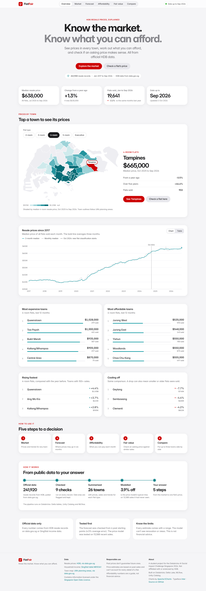
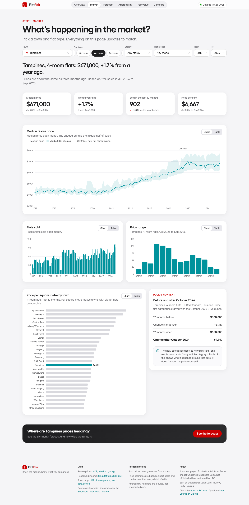
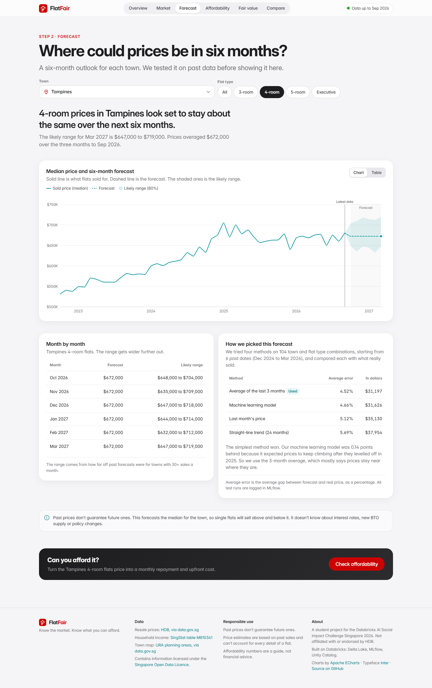
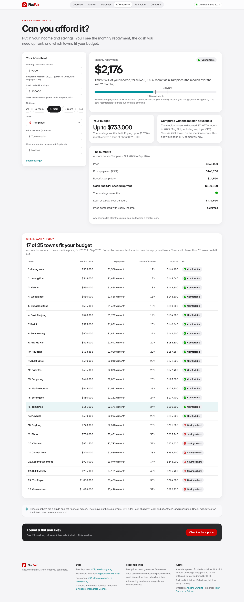
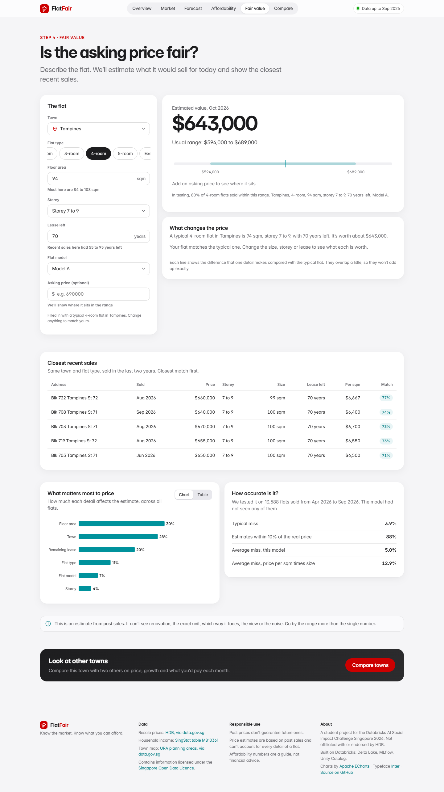
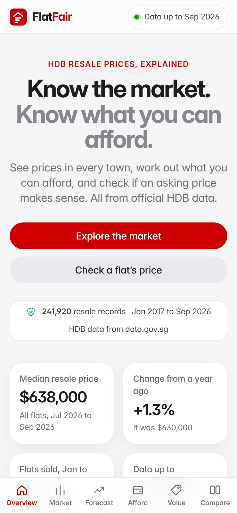
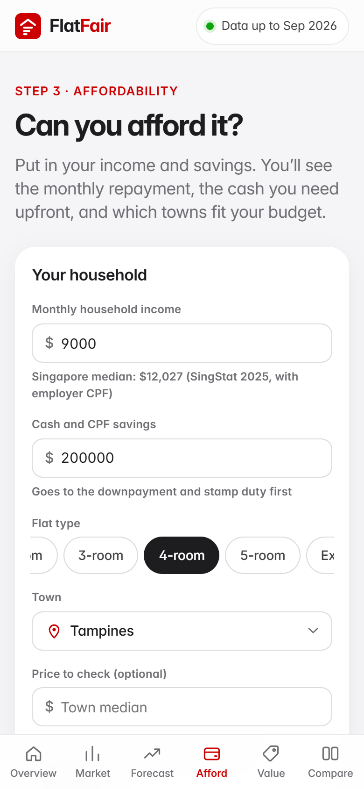

# FlatFair

**Know the market. Know what you can afford.**

FlatFair helps a first-time buyer go from *"what is happening in the HDB resale market?"* to *"is this flat, at this price, sensible for my household?"*. It is built on Singapore's official open data and a Databricks lakehouse pipeline.

Databricks AI Social Impact Challenge Singapore 2026 · Problem **C1: FlatFair, HDB resale market intelligence and affordability forecasting**

**Live demo: [flatfair-nine.vercel.app](https://flatfair-nine.vercel.app)** · Databricks deployment: see [§10](#10-run-it-on-databricks-free-edition)



---

## 1. The problem

HDB resale prices rose sharply over the last decade: the national median went from about $410,000 in 2017 to $638,000 in Q3 2026. Buyers face a data-rich market with thin analytics. Listing sites show asking prices. The official data shows past sales, but in a form most buyers cannot use to answer the questions that matter:

1. Is the market heating up or cooling down where I want to live?
2. What will prices look like by the time I am ready to buy?
3. Can my household carry the loan, and how much cash do I need upfront?
4. Is this particular asking price in line with what similar flats sold for?

## 2. Who FlatFair serves

* **Primary:** young Singaporeans buying their first resale flat, often a couple on a combined income.
* **Secondary:** financial planners and housing counsellors, property researchers, and policy analysts who need a transparent read of the market.

## 3. What it does

Five steps that carry your choices from one page to the next, so they form a single journey:

| Step | Question it answers | What you see |
|---|---|---|
| **Market** | What is happening? | Median price, YoY, momentum, volume, price spread and $/sqm ranking for any town, flat type, storey band, flat model and year range, with the Oct 2024 classification change marked. Towns are picked on a map of Singapore |
| **Forecast** | What could prices do in six months? | Monthly-median forecast with an 80% range, a plain-English reading, and the backtest scorecard that chose the method |
| **Affordability** | Can we afford it? | Monthly repayment, upfront cash (downpayment + stamp duty), repayment-to-income against the 30% MSR cap, a budget, the official median-income benchmark, and *Where can I afford?* across all towns |
| **Fair value** | Is the asking price in line? | Estimated value today, expected range, where the asking price sits, what each attribute is worth vs a typical flat, and the five most comparable recent sales |
| **Compare** | What about alternatives? | Up to three towns side by side on price, growth, outlook and repayment share, with generated takeaways |

Towns are chosen on a **map of Singapore**: every page opens the same picker, shaded by median price, and the chosen town's whole area lights up. The map is drawn from URA's planning area boundaries, so it needs no map service or API key.

A **Data Health** panel in the header shows the row counts, nine quality checks and the source timestamp for the data you are looking at.

The layout adapts from a 360 px phone (with a bottom tab bar) to a 2560 px monitor. `python tests/ui_check.py` checks every page at nine screen sizes in a real browser.

## 4. Architecture

```
data.gov.sg (HDB resale, d_8b84c4ee…)      SingStat Table Builder (M810361)
        │  bulk snapshot or paginated API, retries, schema check
        ▼
BRONZE   bronze_hdb_resale · bronze_income · bronze_ingestion_log        (Delta, raw text, snapshot)
        │  parse, type, standardise, 9 validity checks, flag dups/outliers (nothing deleted)
        ▼
SILVER   silver_hdb_resale  +  gold_data_quality
        │  medians, YoY, momentum, rolling windows, market index, affordability
        ▼
GOLD     gold_market_monthly · gold_town_summary · gold_market_index · gold_affordability · …
        │                                   │
        ▼                                   ▼
 MLflow: forecast backtest (4 methods)   MLflow: fair value (3 models) → UC model registry
        │                                   │
        └───────────────┬───────────────────┘
                        ▼
      Serving bundle in a UC Volume  ──►  FlatFair app (FastAPI + JS)  on Databricks Apps / Vercel
      Spark SQL views + table comments/tags ──► Databricks SQL, dashboards, Genie, lineage
```

Design choices, briefly:

* **One code path everywhere.** The transformation and model code is a tested Python package (`src/flatfair`). Databricks notebooks call it and write Delta tables in Unity Catalog; locally the same functions write parquet. The data is about 240k rows, so pandas is fast and Spark handles storage, governance and SQL.
* **The app never queries a warehouse per request.** The pipeline publishes a small serving bundle (about 8 MB), which the app loads once. That suits Free Edition's single 2X-Small warehouse and keeps every page under 150 ms.
* **Governance.** Every table gets a Unity Catalog comment and `project` / `layer` / `source` tags on write. Notebook 07 defines SQL views so Catalog Explorer shows lineage.

More: [docs/architecture.md](docs/architecture.md).

## 5. Data sources

| Dataset | Publisher | Use | Access |
|---|---|---|---|
| Resale flat prices based on registration date, Jan 2017 onwards (`d_8b84c4ee58e3cfc0ece0d773c8ca6abc`) | HDB via data.gov.sg | All market analytics, forecast, fair value, comparables | `poll-download` snapshot, or `datastore_search` paged 10,000 rows at a time |
| Key Indicators on Household Employment Income among Resident Employed Households (`M810361`, series 5) | SingStat Table Builder | Median household income benchmark ($12,027 a month in 2025, including employer CPF) | Table Builder API |
| Master Plan 2019 Planning Area Boundary, No Sea (`d_4765db0e87b9c86336792efe8a1f7a66`) | URA via data.gov.sg | Shapes for the town map (55 planning areas, simplified to about 2,300 points) | `poll-download` GeoJSON |

All three are used under the [Singapore Open Data Licence](https://data.gov.sg/open-data-licence). The HDB Annual Report and SingStat planning-area population are listed in the brief as context. They are deliberately left for after the MVP (see [docs/product_spec.md](docs/product_spec.md)).

## 6. Databricks components

| Component | Use in FlatFair |
|---|---|
| Delta Lake | Bronze, silver and gold tables in `workspace.flatfair` |
| Unity Catalog | Schema, volume for the serving bundle, table comments and tags, lineage through SQL views, registered model `workspace.flatfair.flatfair_fair_value` |
| Notebooks on serverless compute | `notebooks/01` to `07`, which can run in sequence as a Lakeflow Job |
| MLflow | Forecast backtest (parent run plus one child per method) and fair value training: parameters, metrics, training and validation windows, feature sets, artifacts and the model |
| Databricks SQL | `sql/analytics.sql` and notebook 07 views, for dashboards and a Genie space |
| Databricks Apps | Hosts the FlatFair app (`app.yaml`) |

## 7. ML methodology

**Forecast (six months, town × flat type and town-level).** A rolling-origin backtest from 6 starting points (Dec 2024 to Mar 2026) covers 104 series and 3,702 forecasts. No random splits are used.

| Method | MAPE | MAE |
|---|---|---|
| **3-month average (baseline), selected** | **4.52%** | **$31,198** |
| Gradient boosting with lag, momentum and volume features | 4.66% | $31,627 |
| Last month carried forward | 5.12% | $35,132 |
| Linear trend over 24 months | 5.69% | $37,955 |

The boosted model had the lowest RMSE but leaned about 1.6% high: it learned 2020 to 2024 momentum and the market flattened in 2025 to 2026. FlatFair therefore publishes the baseline. The 80% range comes from the selected method's own backtest errors, by horizon and by series volume.

**Fair value.** The target is `log(price / market index)`, where the index is the national $/sqm of the three *preceding* months. Inputs are town, flat type, flat model, floor area, storey midpoint, remaining lease and month. The model trains on Jan 2017 to Mar 2026 and is tested on 13,588 sales from Apr to Sep 2026 that it never saw.

| Model | MAPE | Median error | Within 10% |
|---|---|---|---|
| Rule of thumb: recent town × type $/sqm × size | 12.88% | 9.54% | 51.8% |
| Ridge regression (one-hot + quadratic numerics) | 7.58% | 6.22% | 71.8% |
| **Gradient boosting, selected** | **4.99%** | **3.89%** | **88.1%** |

Expected range: the central 80% of holdout errors, per flat type. Explanations: permutation importance (floor area 31%, town 28%, remaining lease 20%, flat type 11%, flat model 7%, storey 4%) and a per-flat "what moves this estimate" view against the typical flat of that town and type.

**Affordability.** Annuity repayment at 2.6% over 25 years with 75% loan-to-value (HDB loan defaults, all editable), Buyer's Stamp Duty tiers, and repayment-to-income against the 30% Mortgage Servicing Ratio. "Comfortable" (25% or less) is an illustrative product threshold and is labelled as one.

Full detail: [docs/methodology.md](docs/methodology.md). Every field: [docs/data_dictionary.md](docs/data_dictionary.md).

## 8. Data quality and messy data

The latest run read 241,920 rows and passed all 9 checks: positive price and area, parseable month, no future dates, town and flat type present, possible lease, parseable storey band, schema intact. Nothing is deleted. Problems become flags with named reasons:

* **Three lease formats** (`61 years 04 months`, `70 years`, `61 years 1 month`) are parsed into decimal years. If the text is unreadable, the lease is derived from the commencement year.
* **Floor area and price** arrive as text in mixed formats (`44`, `163.00`, `232000.0`) and are typed.
* **318 exact duplicates** are flagged and kept. HDB publishes no transaction ID, so two identical rows can be two real sales.
* **1,075 unusual prices per sqm** (more than 5 robust SDs within town × type × year) are flagged and kept. Inspection shows premium DBSS blocks and short-lease flats, which the model can explain.
* **The current month** is still being registered (212 rows for Oct 2026 at pull time), so analysis stops at Sep 2026.
* **1-room and multi-generation flats** (178 sales) are excluded from modelling as too sparse, and remain in market views.

## 9. Run it locally

```bash
python -m venv .venv && .venv/Scripts/activate      # macOS/Linux: source .venv/bin/activate
pip install -r requirements-pipeline.txt
python run_pipeline.py                 # ingest → transform → gold → forecast → fair value → publish (~4 min)
uvicorn app.main:app --reload          # http://127.0.0.1:8000
pytest                                 # 77 tests: parsers, cleaning, features, models, affordability, town map, API journey
python tests/ui_check.py               # layout check at nine screen sizes (needs: pip install playwright, and the app running)
mlflow ui --backend-store-uri sqlite:///data/mlflow/mlflow.db   # experiment tracking
```

`python run_pipeline.py ingest --method api` uses the paginated datastore API instead of the bulk snapshot.

## 10. Run it on Databricks (Free Edition)

1. **Workspace → Create → Git folder** and point it at this repository.
2. Run `notebooks/01_ingest_hdb` through `07_sql_views_and_governance` in order, or chain them as a Job. Each installs `scikit-learn==1.7.2` and runs `%run ./00_setup`, which creates `workspace.flatfair` and the `serving` volume.
   *If the workspace cannot reach data.gov.sg,* download the CSV from the dataset page, upload it to the volume, and set the `source_csv` widget in notebook 01.
3. **Compute → Apps → Create app → Custom**, source = the Git folder. `app.yaml` points the app at `/Volumes/workspace/flatfair/serving`. Grant the app's service principal `READ VOLUME` on it (and `USE CATALOG` / `USE SCHEMA`).
4. Deploy and open the app URL.

## 11. Hosted demo (Vercel)

Live at **https://flatfair-nine.vercel.app**. The same FastAPI app deploys to Vercel with zero config (`app/main.py` is a recognised entrypoint; `vercel.json` sets the function). It serves the committed bundle in `data/serving`; the GitHub repo is connected, so rerunning the pipeline and pushing to `main` redeploys. The first request after a quiet spell takes a few seconds while the function starts, so open the site once before presenting.

## 12. Limitations

* **Forecasts** describe the monthly median, not any single flat. They do not use interest rates, BTO supply or policy announcements. In the 2025 to 2026 data they are mostly "about where it is now".
* **Fair value** cannot see renovation, exact unit, facing, view, noise or negotiation. The range matters more than the point estimate.
* **Town medians** shift with the mix of flats sold. A falling median can reflect smaller flats selling, not falling prices.
* **The October 2024 classification change** applies to new BTO flats. Resale records carry no Standard, Plus or Prime field, so any before/after shift is shown as an association only.
* **The income benchmark** includes employer CPF contributions. That differs from the gross income used for MSR, so the comparison is indicative.
* **Affordability** ignores grants, CPF usage limits and accrued interest, loan eligibility checks, legal and agent fees, and renovation.

## 13. Responsible use

* Only public, aggregated open data is used. FlatFair collects no identity. Inputs stay in the browser and in the request that computes the answer; journey choices persist only in the visitor's own browser storage.
* Historical patterns do not guarantee future market movements.
* Fair value estimates are statistical estimates and do not account for every unit-specific characteristic.
* Affordability calculations are informational and not financial advice.
* FlatFair is an independent student project. It is **not affiliated with or endorsed by HDB**. It uses an HDB-inspired colour palette and credits HDB as the data publisher, but does not use HDB's logo or present itself as an official service.

## 14. Screenshots

| | |
|---|---|
|  |  |
|  |  |
|  |  |

## 15. Demo walkthrough

See [docs/demo_script.md](docs/demo_script.md): six scenes, presenter handoffs, likely judge questions and the fallback plan.

## 16. Repository

```
app/            FastAPI app (main.py), services, static front end (HTML/CSS/JS, vendored ECharts + Inter)
src/flatfair/   ingestion, transformation, features, models, affordability, governance, pipeline
notebooks/      Databricks notebooks 00 to 07
config/         config.yaml: every tunable value
sql/            Databricks SQL for dashboards / Genie
tests/          pytest suite, plus ui_check.py (responsive layout check in a real browser)
docs/           architecture, methodology, data dictionary, product spec, demo script, screenshots
data/serving/   published bundle the hosted app serves
```

## 17. Credits

* **Data:** Housing & Development Board (HDB) resale flat prices via data.gov.sg; Singapore Department of Statistics, Table Builder M810361; Urban Redevelopment Authority, Master Plan 2019 planning area boundaries via data.gov.sg. Singapore Open Data Licence.
* **Libraries:** pandas, NumPy, scikit-learn, MLflow, FastAPI, Uvicorn, PyArrow, PyYAML, Requests (BSD / Apache-2.0 / MIT).
* **Front end:** [Apache ECharts](https://echarts.apache.org) (Apache-2.0), [Inter](https://rsms.me/inter/) typeface by Rasmus Andersson (SIL Open Font License).
* **Platform:** Databricks Free Edition (Delta Lake, Unity Catalog, MLflow, Databricks Apps); Vercel for the public demo.
* **Tooling:** built with help from Claude Code (Anthropic).
